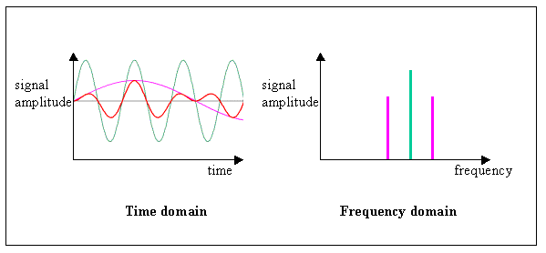

# Video_Highlighter
This project is based on speech analysis. There are various audios which can be used as the dataset for analysing. This project deals with the audio to extract important features from it and provide us with important part of the video from a tournament/game/match video.
## Method
Various methods:
 - NLP: We could have used the text from audio then summarised it to get important phrases and located those important phases in the video
 - Computer Vision: We could have used computer vision by locating important things on screen and storing those timeline. 
 

Cons of using above method:

 - NLP: Extracting text from audio is quite exhaustive and the resultant phases may or may not be accurate which may cause to include noise data from the video
 - Computer Vision: Locating important things at particular interval is also quite exhaustive for the system. This could cause the loss of data
 
 ## My method:
 My method is based on simple speech analysis and short time energy of the sound.
 ### What is short time energy?
 An audio signal can be analyzed in the time or frequency domain. In the time domain, an audio signal is analyzed with respect to the time component, whereas in the frequency domain, it is analyzed with respect to the frequency component:

The energy or power of an audio signal refers to the loudness of the sound. It is computed by the sum of the square of the amplitude of an audio signal in the time domain. When energy is computed for a chunk of an entire audio signal, then it is known as Short Time Energy.
### My method steps:
- Input video's link.
- Download audio and video ,and store them in a folder.
- Extract audio's feature: Audio data and sampling rate.
- Find short time energy in a 5 second window length by going throught the video and store it in an array.
- Sort the energy array in ascending order and find third inter-quartile value from the array.
- Find the start and end time of the clip with high energy in the video and store in a dataframe along with its energy value.
- Replace consecutive clips with a single clip.
- Extract the clip and store in the destination folder

## Testing 
Clone or download the repository  

**Run** `package.sh` file as it will install necessary packages and directorys. 
Run `python main.py` on console.  

(Note: If video length/size is big then use colab/sagemaker. Provided `main.ipynb` for colab/sagemaker.)
